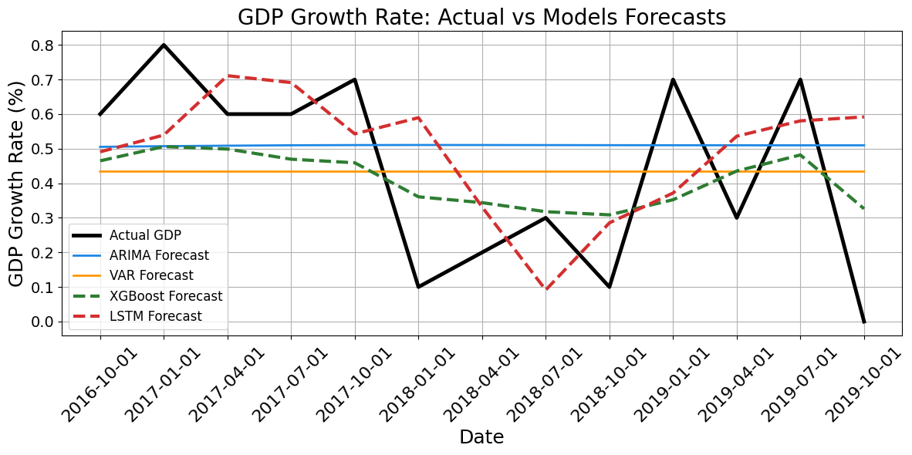
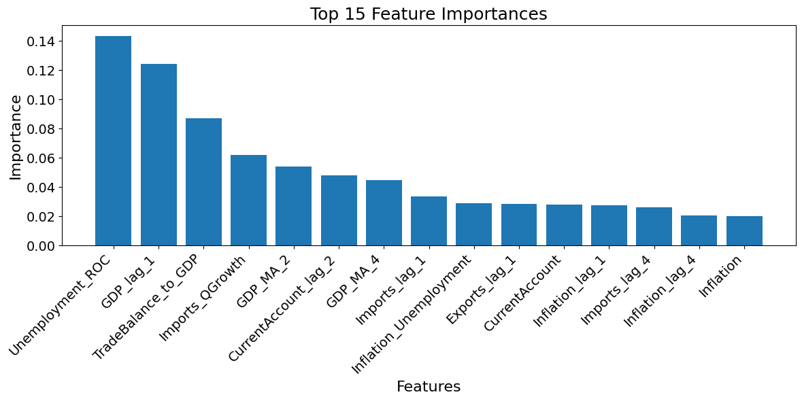

# Forecasting UK GDP Growth: Statistical vs Machine Learning Models

Final-year project for the BEng Computer Science degree at the **University of York** (2025), supervised by Dr. Poonam Yadav.

This project compares two traditional econometric models (**ARIMA**, **VAR**) with two machine learning models (**LSTM**, **XGBoost**) for forecasting quarterly UK GDP growth, using a single, consistent pipeline and evaluation framework.



## Key Results

| Model   | MAE    | RMSE   | R²      |
|---------|--------|--------|---------|
| VAR     | 0.2562 | 0.2991 | -0.5162 |
| ARIMA   | 0.2337 | 0.2717 | -0.2508 |
| LSTM    | 0.2236 | 0.2673 | -0.0729 |
| **XGBoost** | **0.1969** | **0.2176** | **0.3386** |

- **XGBoost** performed best on every metric and was the only model with a positive R², cutting mean absolute error by around 16% compared with ARIMA.
- **LSTM** outperformed both traditional models, though it was limited by the small size of the dataset.
- **ARIMA** gave a stable, interpretable baseline but reacted slowly to sharp changes.
- **VAR** was the weakest, being sensitive to lag selection and noise from less informative variables.

The metrics above are those reported in the dissertation, computed on each model's test set. The CSV files in `results/` contain forecasts over the shared comparison window (Q4 2016 – Q4 2019) used for the combined chart.

## Data

All data comes from the **UK Office for National Statistics (ONS)** and is published under the [Open Government Licence v3.0](https://www.nationalarchives.gov.uk/doc/open-government-licence/version/3/). It covers quarterly observations from **Q1 1997 to Q4 2019**.

| Indicator | File |
|-----------|------|
| GDP growth rate (%) — target variable | `data/raw/GDP_growth_rate.csv` |
| Inflation rate (%) | `data/raw/inflation_uk.csv` |
| Unemployment rate (%) | `data/raw/unemployment_rate.csv` |
| Current account balance | `data/raw/current_account_balance.csv` |
| Exports of goods and services | `data/raw/export_uk.csv` |
| Imports of goods and services | `data/raw/import_uk.csv` |

The individual series are combined into a single aligned dataset in `data/processed/macro_data.csv`. A shorter window with more indicators was chosen over a longer history with fewer indicators, so that the machine learning models could be assessed on a richer feature set.

## Methodology

1. **Pre-processing:** alignment of all indicators to a common quarterly timeline, handling of missing values, Augmented Dickey-Fuller stationarity tests and differencing where required, and Min-Max scaling.
2. **Chronological split:** 70% training, 15% validation and 15% test, preserving time order to avoid information leakage.
3. **Models:**
   - **ARIMA** — univariate model; order (3,0,0) selected by grid search on AIC/BIC.
   - **VAR** — multivariate model on differenced series; lag order 2 selected by grid search (lags 1–8).
   - **LSTM** — single LSTM layer (50 units) on four-quarter input sequences, trained with Adam and MSE loss.
   - **XGBoost** — gradient-boosted trees on engineered features: lags, moving averages, rates of change, trade ratios and interaction terms. Shallow trees, a slow learning rate and L1/L2 regularisation were used to limit overfitting.
4. **Evaluation:** MAE, RMSE and R² on a common test set, plus residual diagnostics (ACF/PACF).



## Repository Structure

```
├── data/
│   ├── raw/                  # Individual ONS series
│   └── processed/            # Combined, aligned dataset (macro_data.csv)
├── notebooks/
│   ├── 01_ARIMA_Model.ipynb
│   ├── 02_VAR_Model.ipynb
│   ├── 03_LSTM_Model.ipynb
│   ├── 04_XGBoost_Model.ipynb
│   └── 05_Model_Comparison.ipynb
├── results/                  # Forecasts from each model over the comparison window
├── images/                   # Figures used in this README
├── report/                   # Full dissertation (PDF)
└── requirements.txt
```

## How to Run

```bash
git clone https://github.com/Tunasisman/uk-gdp-forecasting-ml.git
cd uk-gdp-forecasting-ml
pip install -r requirements.txt
jupyter notebook
```

Open the notebooks in the `notebooks/` folder and run them in order. Notebooks 01–04 train and evaluate each model; notebook 05 combines their forecasts into a single comparison.

## Tools

Python, pandas, NumPy, statsmodels, scikit-learn, XGBoost, TensorFlow/Keras, Matplotlib, Seaborn. Development was carried out in Google Colab.

## Future Work

- Multivariate LSTM or Transformer-based models using all indicators
- Ensembles combining traditional and machine learning forecasts
- Explainability with SHAP values
- Longer, multi-step forecast horizons
- Exogenous shocks and variables (e.g. ARIMAX, policy changes)

## Report

The full dissertation, including the literature review and detailed evaluation, is available in [`report/Final_Year_Project_Report.pdf`](report/Final_Year_Project_Report.pdf).

## Author

**Tunahan Sisman** — [LinkedIn](https://www.linkedin.com/in/tunahansisman) · [GitHub](https://github.com/Tunasisman)
